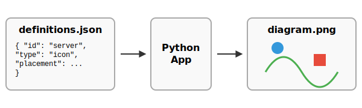

# PNGDrawer - A Declarative Diagram Renderer

PNGDrawer is an application that generates high-quality PNG diagrams from a set of simple, declarative JSON files. It allows you to define complex layouts, connections, and styles using a "diagram as code" approach, ensuring your documentation is version-controllable and easy to maintain.

The rendering engine is built with Python and the Pillow library, using an addon-based architecture that makes it highly extensible.



---

## Features

- **Declarative JSON Definitions**: Describe every aspect of your diagram—from canvas size to object placement—in simple JSON files.
- **Precise Layout Engine**: Position objects absolutely, relative to the canvas boundaries, or relative to each other using a powerful anchor and offset system.
- **Layering**: Control the stacking order of objects to create complex, overlapping designs.
- **High-Quality Rendering**: Uses a 4x supersampling technique to produce smooth, anti-aliased lines and crisp text.
- **Vector Icon Support**: Directly uses SVG icons for scalable, high-quality graphics.
- **Flexible Connections**: Draw straight, curved, or S-shaped lines between any two objects.
- **Modular Addon Architecture**: The core rendering engine is built on a plugin-like system, making it easy to add new features and capabilities.

---

## Quick Start

1.  **Define your diagram**: Create a new folder inside the `definitions/` directory (e.g., `my-new-diagram`). Inside it, create a `nodes.json` and an `edges.json` file to describe your objects and their connections.

2.  **Run the application**: From the project root, execute the `run.py` script, passing the name of your definition folder.

    ```bash
    python3 run.py my-new-diagram
    ```

3.  **Find your output**: The final `my-new-diagram.png` will be saved in the `output/` directory.

---

## Using with Generative AI

To accelerate the creation of diagram definitions, you can use a generative AI. A compact guide detailing the application's JSON schema is provided in the `docs/` folder.

**File**: `docs/genAI_compact_guide.md`

### How to Use

1.  **Copy the Guide**: Open the `genAI_compact_guide.md` file and copy its entire content.
2.  **Provide Context to the AI**: Paste the copied guide as a preamble or system prompt to your chosen generative AI. This teaches the AI the rules of the system.
3.  **Make Your Request**: After providing the context, make a clear request for the diagram you want.

### Example Prompt

> (Paste the entire content of genAI_compact_guide.md here)
>
> ---
>
> Now, acting as an expert in this system, please generate the complete set of JSON files (`canvas.json`, `icons.json`, `nodes.json`, and `edges.json`) for a simple diagram.
>
> The diagram should show a user icon connecting to a web server, which then connects to a database. Use appropriate labels and icons for each.

---

## Documentation

For a complete explanation of all features, file formats, and advanced usage, please refer to the **[Full User Guide](docs/guide/index.md)**.

The guide provides an exhaustive breakdown of:
- Core concepts and project structure.
- How to define and position objects.
- All connection types (straight, curve, s-curve).
- Advanced layout and layering techniques.
