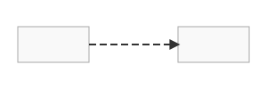
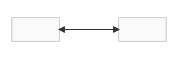

# Guide: Connection Styling

You can control the style of the lines drawn between objects by adding an optional `connection` object to any edge definition in `edges.json`.

## Line Style

-   **`style`** (string, optional): The style of the line.
    -   `"solid"`: (Default) A solid line.
    -   `"dashed"`: A dashed line.
    -   `"dotted"`: A dotted line.

### Example
```json
"connection": {
  "style": "dashed"
}
```


---

## Line Shape

-   **`type`** (string, optional): `"straight"` (default), `"curve"`, or `"s-curve"`.

### Curved Lines
-   **`type`**: `"curve"`
-   **`bend`** (float, optional): Controls curvature. Positive values bend one way, negative values bend the other. Defaults to `0.5`.

### S-Curved Lines
-   **`type`**: `"s-curve"`
-   **`bend`** (array of float `[start_bend, end_bend]`, optional): Controls the S-shape. Defaults to `[0.5, -0.5]`.


---

## Arrow Direction

-   **`direction`** (string, optional): Controls the arrowheads.
    -   `"forward"`: (Default) Draws an arrow from source to target.
    -   `"backward"`: Draws an arrow from target to source.
    -   `"bidirectional"`: Draws arrows on both ends.
    -   `"none"`: Draws a line with no arrowheads.

### Example
```json
"connection": {
  "direction": "bidirectional"
}
```


---
**Back to index:** [Index](./index.md)
