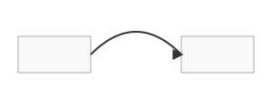

# Guide: Connection Styling

You can control the style of the lines drawn between objects by adding an optional `connection` object to any edge definition in `edges.json`.

## Straight Lines (Default)

If the `connection` object is omitted, a straight line will be drawn between the specified anchor points of the source and target nodes.

### Example
```json
// This will be a straight line
{
  "source_id": "node_a",
  "target_id": "node_b"
}
```


---

## Curved Lines

To create a simple, single-bend curve, use the `curve` type.

-   **`type`**: `"curve"`
-   **`bend`** (float, optional): A number that controls the direction and amount of curvature.
    -   Positive values (e.g., `0.5`) bend the line one way.
    -   Negative values (e.g., `-0.5`) bend it the other way.
    -   Defaults to `0.5`.

### Example
```json
"connection": {
  "type": "curve",
  "bend": -0.7
}
```


---

## S-Curved Lines

To create a more complex S-shaped line (a cubic Bézier curve), use the `s-curve` type. This is useful for navigating around other objects.

-   **`type`**: `"s-curve"`
-   **`bend`** (array of float, optional): An array of two numbers, `[start_bend, end_bend]`, that control the curvature at the start and end of the line, respectively. This allows you to fine-tune the "S" shape.
    -   Defaults to `[0.5, -0.5]`.

### Example

This creates an S-curve that bends one way near the source and the opposite way near the target.

```json
"connection": {
  "type": "s-curve",
  "bend": [0.6, -0.6]
}
```

