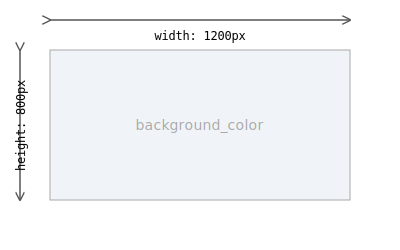

# Guide: The Canvas (`canvas.json`)

The `canvas.json` file defines the global properties of your diagram's canvas. It sets the stage for all the objects you will draw.

## Properties

-   **`width`** (integer, required): The width of the final output PNG image in pixels.
-   **`height`** (integer, required): The height of the final output PNG image in pixels.
-   **`background_color`** (string, optional): The background color of the canvas. This can be a hex code (e.g., `"#FFFFFF"`) or a named color (e.g., `"white"`). Defaults to `"white"`.

## Example

This example creates a canvas that is 1200 pixels wide and 800 pixels tall with a light grey background.

**`definitions/my-diagram/canvas.json`**
```json
{
  "width": 1200,
  "height": 800,
  "background_color": "#F0F4F8"
}
```


---
**Next:** [Nodes (`nodes.json`)](./defining-nodes.md)
