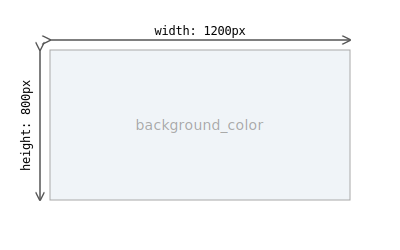

# Guide: The Canvas (`canvas.json`)

The `canvas.json` file defines the global properties of your diagram's canvas. It sets the stage for all the objects you will draw.

## Basic Properties

-   **`width`** (integer, required): The width of the final output PNG image in pixels.
-   **`height`** (integer, required): The height of the final output PNG image in pixels.
-   **`background_color`** (string, optional): The background color of the canvas. Defaults to `"white"`.

### Example
```json
{
  "width": 1200,
  "height": 800,
  "background_color": "#F0F4F8"
}
```


---

## Border Properties

You can add an optional `border` object to your `canvas.json` to draw a border around the entire canvas.

-   **`border`** (object, optional): An object to define the border.
    -   **`color`** (string): The color for the border (e.g., `"#6c757d"`).
    -   **`width`** (integer): The width of the border in pixels.
    -   **`type`** (string): The style of the border. Can be `"solid"`, `"dashed"`, or `"dotted"`.

### Example with Border

This example adds a 2-pixel wide, dashed grey border to the canvas.

**`definitions/my-diagram/canvas.json`**
```json
{
  "width": 1200,
  "height": 800,
  "background_color": "#FFFFFF",
  "border": {
    "color": "#6c757d",
    "width": 2,
    "type": "dashed"
  }
}
```


---
**Next:** [Nodes (`nodes.json`)](./defining-nodes.md)\
**Back to index:** [Index](./index.md)
