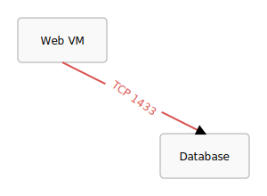

# Guide: Connections (`edges.json`)

The `edges.json` file defines all the connections (lines and arrows) between your nodes. It is an array of edge objects.

## Properties

-   **`source_id`** (string, required): The `id` of the node where the connection starts.
-   **`target_id`** (string, required): The `id` of the node where the connection ends.
-   **`label`** (string, optional): Text that will be drawn near the midpoint of the line.
-   **`color`** (string, optional): The color of the line, arrowhead, and label. Defaults to `black`.
-   **`source_anchor`** (string, optional): The anchor point on the source object from which the line will emerge. Defaults to `"right"`. See the [Placement System](./placement-system.md) guide for a list of all anchor points.
-   **`target_anchor`** (string, optional): The anchor point on the target object at which the line will arrive. Defaults to `"left"`.
-   **`connection`** (object, optional): An object that defines the style of the line. See the [Connection Styling](./connection-styles.md) guide for details on straight, curved, and S-curved lines.

## Example

**`definitions/my-diagram/edges.json`**
```json
[
  {
    "source_id": "web_vm",
    "target_id": "database",
    "label": "TCP 1433",
    "color": "#D9534F",
    "source_anchor": "bottom",
    "target_anchor": "top"
  },
  {
    "source_id": "database",
    "target_id": "backup_storage",
    "connection": {
      "type": "curve",
      "bend": -0.4
    }
  }
]
```


---
**Next:** [The Placement System](./placement-system.md)
