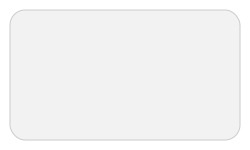

# Guide: Nodes (`nodes.json`)

The `nodes.json` file is where you define all the visual objects that will appear on your diagram. It is an array of node objects, each with a unique ID and a set of properties that describe its appearance and position.

## Common Node Properties

All node types share these common properties:

-   **`id`** (string, required): A unique identifier for the node. This is used to reference the node in other files, such as `edges.json` and `layout.json`.
-   **`type`** (string, required): The type of object to draw. Can be `"icon"`, `"shape"`, or `"text"`.
-   **`layer`** (integer, optional): The drawing layer for the object. Objects with higher numbers are drawn on top of objects with lower numbers. Defaults to `1`.
-   **`placement`** (object, required): An object that defines how the node is positioned on the canvas. See the [Placement System](./placement-system.md) guide for full details.

---

## Node Type: `icon`

Used to draw an SVG or PNG icon.

-   **`icon_id`** (string, required): The ID of the icon to use, as defined in your `icons.json` mapping file.
-   **`size`** (array of int, optional): An array `[width, height]` to resize the icon. If omitted, the icon's native size is used.
-   **`label`** (string, optional): Text that will be drawn directly below the icon.

### Example
```json
{
  "id": "prod_server",
  "type": "icon",
  "icon_id": "azure-vm",
  "label": "Production Server",
  "size": [64, 64],
  "layer": 2,
  "placement": { "type": "absolute", "x": 100, "y": 100 }
}
```


---

## Node Type: `shape`

Used to draw simple geometric shapes.

-   **`shape`** (string, required): The type of shape to draw. Currently supports `"rounded_rectangle"`.
-   **`size`** (array of int, required): An array `[width, height]` that defines the dimensions of the shape.
-   **`color`** (string, required): The fill color for the shape (e.g., `"#E0EAF1"`).
-   **`radius`** (integer, optional): For a `rounded_rectangle`, this defines the corner radius. Defaults to `15`.

### Example
```json
{
  "id": "background_box",
  "type": "shape",
  "shape": "rounded_rectangle",
  "size": [800, 500],
  "color": "#F2F2F2",
  "layer": 0,
  "placement": { "type": "absolute", "x": 50, "y": 50 }
}
```


---

## Node Type: `text`

Used to draw standalone text.

-   **`text`** (string, required): The text content to display.
-   **`font_size`** (integer, optional): The font size. Defaults to `15`.
-   **`color`** (string, optional): The color of the text. Defaults to `"#000000"` (black).

### Example
```json
{
  "id": "diagram_title",
  "type": "text",
  "text": "Corporate Network Architecture",
  "font_size": 24,
  "color": "#333333",
  "layer": 3,
  "placement": { "type": "absolute", "x": 20, "y": 20 }
}
```


---
**Next:** [Icons (`icons.json`)](./defining-icons.md)
**Back to index:** [Index](./index.md)
