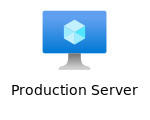

# Guide: Nodes (`nodes.json`)

The `nodes.json` file is where you define all the visual objects that will appear on your diagram. It is an array of node objects.

## Common Node Properties

All node types share these common properties:

-   **`id`** (string, required): A unique identifier for the node.
-   **`type`** (string, required): `"icon"`, `"shape"`, or `"text"`.
-   **`layer`** (integer, optional): The drawing layer for the object. Higher numbers are drawn on top. Defaults to `1`.
-   **`placement`** (object, required): An object that defines the node's position. See the [Placement System](./placement-system.md) guide for full details.
-   **`label`** (string or object, optional): A text label for the node. This is a generic property available for both `icon` and `shape` types.
    -   If a **string** is provided, the label is drawn at the default `bottom` position.
    -   If an **object** is provided, you can specify the position:
        -   **`text`** (string): The label text.
        -   **`position`** (string): Can be `top`, `bottom`, `left`, `right`, `center`, `top_left`, `top_right`, `bottom_left`, `bottom_right`.

---

## Node Type: `icon`

Draws an SVG or PNG icon.

-   **`icon_id`** (string, required): The ID of the icon from `icons.json`.
-   **`size`** (array of int, optional): `[width, height]` to resize the icon.

### Example 1: Simple Label
Using a simple string for the `label` property places it in the default "bottom" position.

```json
{
  "id": "web_server",
  "type": "icon",
  "icon_id": "azure-vm",
  "label": "Web Server",
  "size": [64, 64],
  "placement": { "type": "absolute", "x": 100, "y": 100 }
}
```


### Example 2: Positioned Label
Using an object for the `label` property allows for precise positioning.

```json
{
  "id": "prod_server",
  "type": "icon",
  "icon_id": "azure-vm",
  "label": {
    "text": "Production Server",
    "position": "right"
  },
  "size": [64, 64],
  "placement": { "type": "absolute", "x": 100, "y": 100 }
}
```


---

## Node Type: `shape`

Draws simple geometric shapes.

-   **`shape`** (string, required): Currently supports `"rounded_rectangle"`.
-   **`size`** (array of int, required): `[width, height]` for the shape's dimensions.
-   **`color`** (string, required): The fill color. Can be a hex code or `"none"` for a transparent fill.
-   **`radius`** (integer, optional): Corner radius for `rounded_rectangle`.
-   **`border`** (object, optional): Defines a custom border for the shape.
    -   **`color`** (string): The border color.
    -   **`width`** (integer): The border width in pixels.
    -   **`type`** (string): The border style. Can be `"solid"`, `"dashed"`, or `"dotted"`.

### Example: Shape with Label and Border
Shapes can also have labels, just like icons. This example shows a shape with a positioned label and a custom dashed border.

```json
{
  "id": "vnet_background",
  "type": "shape",
  "shape": "rounded_rectangle",
  "label": { "text": "VNet-01", "position": "top_left" },
  "size": [400, 300],
  "color": "#F0F4F8",
  "border": {
    "color": "#0078D4",
    "width": 2,
    "type": "dashed"
  },
  "placement": { "type": "absolute", "x": 50, "y": 50 }
}
```


---

## Node Type: `text`

Draws standalone text. This type does not use the `label` property, as its primary purpose is to display text directly.

-   **`text`** (string, required): The text content to display.
-   **`font_size`** (integer, optional): The font size.
-   **`color`** (string, optional): The color of the text.

### Example
```json
{
  "id": "diagram_title",
  "type": "text",
  "text": "Corporate Network Architecture",
  "font_size": 24,
  "color": "#333333",
  "layer": 3,
  "placement": { "type": "absolute", "x": 20, "y": 20 }
}
```


---
**Next:** [Icons (`icons.json`)](./defining-icons.md)\
**Back to index:** [Index](./index.md)
