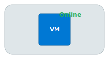

# Guide: Layering Objects

The `layer` property allows you to control the stacking order of objects in your diagram. This is essential for creating complex designs where some objects need to appear on top of others, such as placing an icon on top of a background shape.

## How It Works

The `layer` property is an optional integer you can add to any node definition in `nodes.json`.

-   Objects with a **higher** `layer` number are drawn **on top of** objects with a lower `layer` number.
-   Objects with the same `layer` number may be drawn in any order relative to each other.
-   If the `layer` property is omitted, it defaults to `1`.

The rendering engine draws all objects in ascending order of their layer number.

## Example

In this example, we create a background shape, place an icon on top of it, and then add a text label on top of everything.

**`definitions/my-diagram/nodes.json`**
```json
[
  {
    "id": "background",
    "type": "shape",
    "shape": "rounded_rectangle",
    "size": [200, 100],
    "color": "#DFE6E9",
    "layer": 0,
    "placement": { "type": "absolute", "x": 50, "y": 50 }
  },
  {
    "id": "server_icon",
    "type": "icon",
    "icon_id": "azure-vm",
    "size": [64, 64],
    "layer": 1,
    "placement": {
      "type": "relative",
      "target_id": "background",
      "target_anchor": "center",
      "self_anchor": "center"
    }
  },
  {
    "id": "status_badge",
    "type": "shape",
    "shape": "rounded_rectangle",
    "size": [54, 20],
    "color": "#FFFFFF",
    "radius": 10,
    "layer": 2,
    "placement": {
      "type": "relative",
      "target_id": "server_icon",
      "target_anchor": "top_right",
      "self_anchor": "center",
      "offset": { "x": 0, "y": -5 }
    }
  },
  {
    "id": "status_text",
    "type": "text",
    "text": "Online",
    "color": "#27AE60",
    "layer": 3,
    "placement": {
      "type": "relative",
      "target_id": "status_badge",
      "target_anchor": "center",
      "self_anchor": "center"
    }
  }
]
```


---
**Next:** [Straight, Curved, and S-Curved Lines](./connection-styles.md)
**Back to index:** [Index](./index.md)
