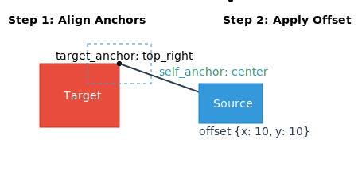

# Guide: The Placement System

The `placement` object is a required property for every node in `nodes.json`. It gives you precise control over where each object is located on the canvas.

## Anchor Points

The `relative` placement type and edge connections use anchor points to define alignment. An anchor is a specific point on an object's bounding box.

The available anchor points are:
-   `top`, `bottom`, `left`, `right` (aliases for the center-midpoints)
-   `center`
-   `top_left`, `top_center`, `top_right`
-   `center_left`, `center_right`
-   `bottom_left`, `bottom_center`, `bottom_right`


---

## Placement Type: `absolute`

This is the simplest placement type. It positions an object's top-left corner at exact pixel coordinates from the canvas's top-left corner.

-   **`type`**: `"absolute"`
-   **`x`** (integer): The horizontal distance from the left edge.
-   **`y`** (integer): The vertical distance from the top edge.

### Example
```json
"placement": {
  "type": "absolute",
  "x": 50,
  "y": 100
}
```


---

## Placement Type: `relative`

This is the most powerful placement type. It positions an object relative to another object.

-   **`type`**: `"relative"`
-   **`target_id`** (string): The `id` of the object to position against.
-   **`target_anchor`** (string): The anchor point on the *target* object to align with.
-   **`self_anchor`** (string): The anchor point on *this* object that will be aligned with the target's anchor.
-   **`offset`** (object, optional): An object with `x` and `y` properties to apply a pixel offset after the alignment.

### Example

This places the `self_anchor` of the source object on the `target_anchor` of the target object, and then applies the offset.

```json
"placement": {
  "type": "relative",
  "target_id": "target_node",
  "target_anchor": "top_right",
  "self_anchor": "center",
  "offset": { "x": 100, "y": 50 }
}
```


---

## Placement Type: `boundary`

This type places an object relative to the canvas edges. It's useful for centering objects or placing them in corners.

-   **`type`**: `"boundary"`
-   **`vertical`** (string): `"top"`, `"center"`, or `"bottom"`.
-   **`horizontal`** (string): `"left"`, `"center"`, or `"right"`.

### Example

This centers an object perfectly on the canvas.

```json
"placement": {
  "type": "boundary",
  "vertical": "center",
  "horizontal": "center"
}
```


---
**Next:** [Layering Objects](./layering.md)\
**Back to index:** [Index](./index.md)
